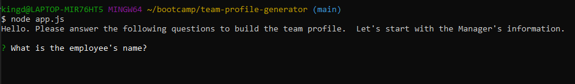
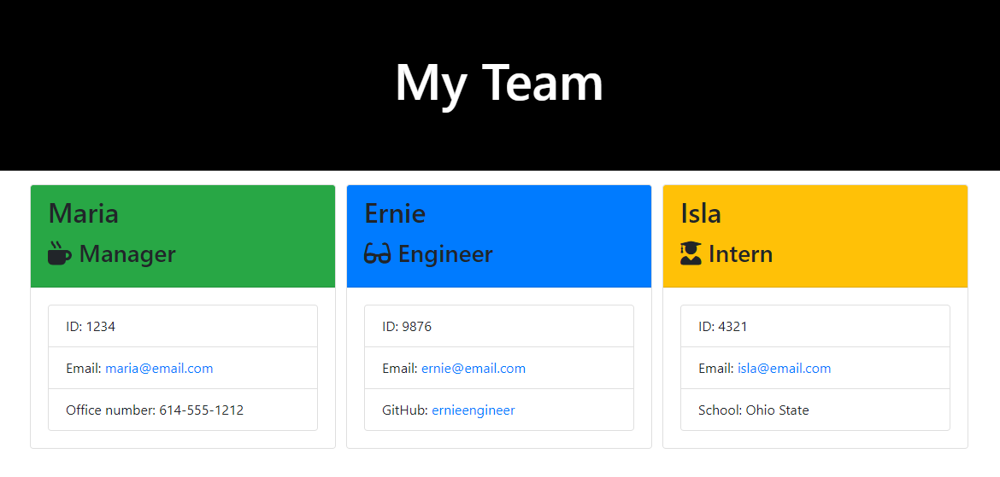

# Bootcamp Homework 10 - OOP: Template Engine - Employee Summary

[](https://opensource.org/licenses/MIT)
## Description
This is a coding bootcamp homework assignment to create a Node CLI that takes in information about employees from user's input using the the [Inquirer package](https://www.npmjs.com/package/inquirer) and generates an HTML webpage that displays summaries for each employee. This homework also incorporates unit tests run with [jest](https://jestjs.io/). 






## Table of Contents
* [Installation](#Installation)
* [Usage](#Usage)
* [Contributing](#Contributing)
* [Questions](#Questions)
* [License](#License)
* [Links](#Links)
## Installation
Install the following dependencies: 
```bash
npm install
npm install inquirer
npm install email-validator
```
## Usage
Execute the Team Profile Generator with 
```bash
node app.js
```
Run the tests with 
```bash
npm run test
```
or
```bash
npx jest
```

## Contributing
Fork the repo and submit a pull request to enhance the code or fix a bug
## Questions
Have questions?  Contact me on [GitHub](https://github.com/thorgriffs) or email <22.kelliking@gmail.com>
## License

  [MIT](https://github.com/thorgriffs/team-profile-generator/blob/main/LICENSE) License
  
  Copyright (c) 2020 Kelli King

## Links
* [Walkthrough Video](https://drive.google.com/file/d/1-JcoHCIryS8qfPAk8ecfMhNjoX7VoMk0/view)